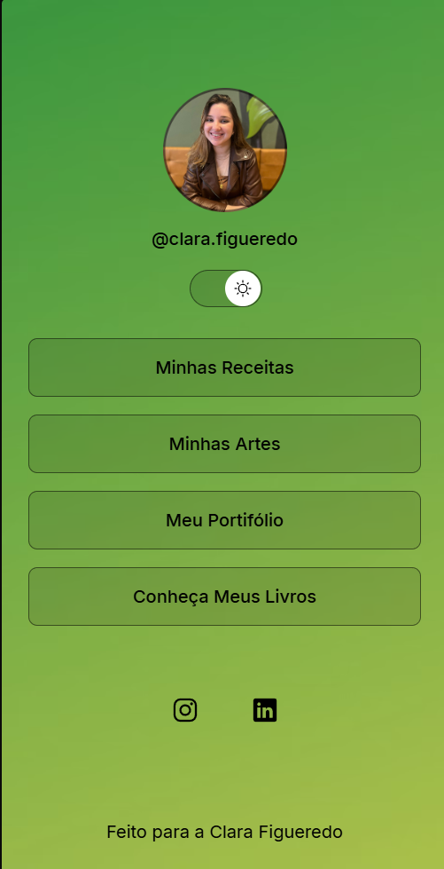

# 🌐 Clara Links

.jpg) <!-- Substitua com o caminho correto da imagem -->

> Uma página única, moderna e responsiva para concentrar seus links pessoais ou profissionais.  
Inspirado na ideia do Linktree, com base no projeto desenvolvido durante o curso **Discover da Rocketseat**, e adaptado com identidade visual e estrutura personalizada por mim.

---

## 📸 Preview

 <!-- Substitua com o print real do projeto -->

---

## 🚀 Funcionalidades

- ✅ Interface totalmente responsiva (mobile-first)
- ✅ Personalização fácil de links, títulos e estilo
- ✅ Layout simples e elegante
- ✅ Suporte a ícones e redes sociais
- ✅ Modo claro e escuro *(se implementado)*

---

## 🛠️ Tecnologias Utilizadas

| Tecnologia  | Descrição                             |
|-------------|---------------------------------------|
| `HTML5`     | Estrutura da página                   |
| `CSS3`      | Estilização e responsividade          |
| `JavaScript`| Interatividade (modo escuro, etc.)    |
| `Figma`     | Desgin e plano de código              |

---

## 📦 Como instalar e usar

### 🔧 HTML/CSS/JS puro:
1. Clone o repositório:

```bash
git clone https://github.com/EduZorSilva/clara-links.git
cd clara-links
